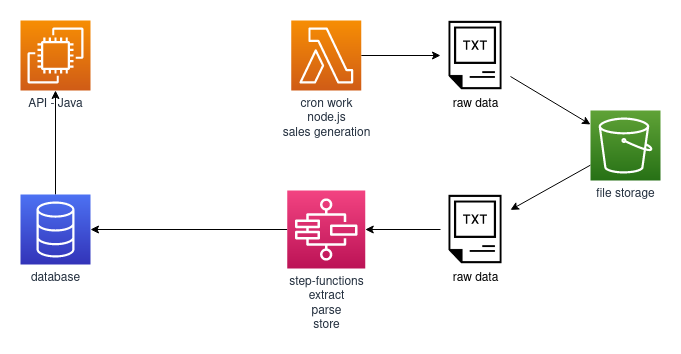

# Sales view system - micro-services
- This is a code repository to store the micro-services of sales view system.
This micro-services has as main purpose generate dummy data of credit card sales, and extract, parse and store this data.

- In this repository we have the code of the **cron work** and **step-functions**.

<!-- - The code of the API is in another repository -->

- Built using **Serverless** framework with **node.js/Typescript** inside **AWS**' infrastructure.

- Macro architecture of sales view system:
- 

## **Pre-Requisites**
1. First need to install serverless framework globally. to do so, run this following command on terminal:

	`npm i -g serverless`

1. Install aws-cli, follow the [official guide](https://docs.aws.amazon.com/cli/latest/userguide/cli-chap-install.html)

1. Setup Serverless with [aws-cli](https://serverless.com/framework/docs/providers/aws/guide/credentials#setup-with-the-aws-cli)

1. Then install project dependencies:

	`npm i`


## **How to Run**
After all pre-requisites are fulfilled, run the following command from terminal inside the handlers folder you want to deploy, replacing [stage] for a value that matches your aws' stage.

`sls deploy --stage [stage]`

If completed successfully, the endpoints uploaded will be shown in your terminal, user a tool like *curl* or *Postman* to test them.
You can also check the stack status inside AWS' console at *CloudFormation* service.


## **Folder Structure**
* **/resources**: this folder contains .yml files responsible for declaring the infrastructure as code, all aws' infra. used by the system shall be declared here.

* **/src/core**: This folder contains some generic and shared classes.

* **/src/env**: This folder have an env.ts file. Inside this file all the env variables are imported from process.env to a **const** that can be easily imported through all system.

### **Inside *src/workers***:
*  **handlers**: Inside handlers folder, are all of the micro-services available for this system, all separated in it's own folder. e.g.: UserHandlers, TransactionHandler, etc. In each of these folders, you'll find one file per function and a single serverless.yml file describing how they shall be deployed. A handler is responsible for parsing and extracting relevant information from the event, to direct it to the correct service and to parse the response sent.

* **models**: Inside models folder, are all entities mapped by the system. Each one in it's own file. These are used by TypeOrm to map DB relations and to build the database through it's decorators.

* **services**: A Service is responsible for the business logic and is the only one to have access to a repository's methods.

* **repositories**: A Repository is responsible for all operations made inside the database and is only accessible via service. For the operations, TypeOrm provides generic classes for common functions and an API for custom ones.

## **Testing**
The libs used for testing are *jest* and *supertest*.
To run jest tests we need to install it globally by running:

`npm i -g jest`


All the scripts defined in `package-scripts.js` file can be run by npm, just by adding them inside *scripts* in `package.json`. So, using the script above, we'd define package.json's
scripts like:
```json
"scripts": {
	"test": "nps test",
	"deploy-test": "nps deploy.test"
}
```
And we run them using: `npm test`

<!-- ## **Database/TypeOrm Scripts**
As the project grows further, database tends to have changes and to grow, in these situations we use migrations to keep track of the changes. [TypeOrm](https://typeorm.io/#/) provides us
with a cli to manage our database changes and an [API](https://typeorm.io/#/migrations/using-migration-api-to-write-migrations) to change our schema programatically without the need to run native queries.
Our migrations are located inside: *src/core/database/migrations*.

**OBS:** All commands cited bellow are wrapped using *npm* and *nps*, for the real commands, check *package-scripts.js* file.

### **Setup Database**
The database creation is already covered by serverless.yml's resources but to update it to the latest schema, you need to run the following command:

`npm run setup`

**OBS:** if you already have a schema filled with data, this command will erase it all, recreate the schema and run all migrations available.

### **Create a new migration**
To create a new migration, run the following command:

`npm run migration-create -- -n [MigrationName]`

**E.g**: `npm run migration-create -- -n UserLastNameMigration`

This will only generate a migration file, which implements a *MigrationInterface* that requires the implementation of 2 methods *up* and *down*.

***up*** represents the changes the migration must do when ran.

***down*** represents the changes the migration must do when reverted.

**OBS:** The migration API does not validate automatically the existence or non-existence of tables, columns, FKs, etc. This must be done manually.


### **Run Migrations**
When you execute the migrations, all migrations that were not ran until this moment will be executed. TypeOrm controls this through a table named *migrations*.

To run migrations, run the following command:

`npm run migrate`

### **Revert Migrations**
When you revert a migration, only the last migration will be reverted.

To revert a migration, run the following command:

`npm run revert` -->
